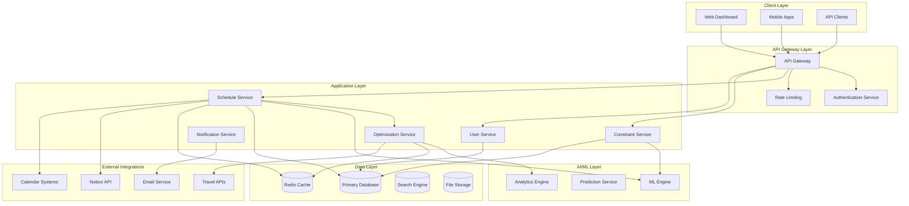
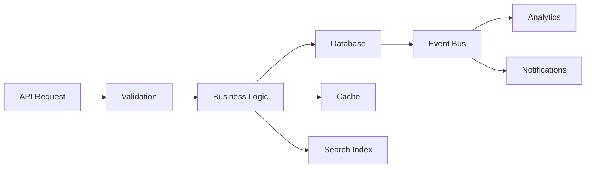
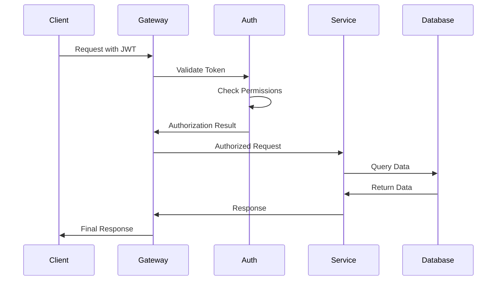

# FlexTime System Architecture

This comprehensive architecture documentation covers the design decisions, system components, and technical infrastructure that power the FlexTime Scheduling System.

## 🏗️ Architecture Overview

FlexTime is built as a modern, microservices-based system designed for scalability, reliability, and maintainability. The architecture follows cloud-native principles and leverages AI/ML capabilities for intelligent scheduling optimization.



## 📚 Architecture Documentation

### System Design
- **[High-Level Architecture](./high-level-architecture.md)** - System overview and component relationships
- **[Microservices Architecture](./microservices.md)** - Service boundaries and communication patterns
- **[Data Architecture](./data-architecture.md)** - Database design and data flow
- **[Security Architecture](./security-architecture.md)** - Security layers and access controls

### Core Components
- **[API Gateway](./components/api-gateway.md)** - Request routing and management
- **[Scheduling Engine](./components/scheduling-engine.md)** - Core scheduling algorithms
- **[Constraint System](./components/constraint-system.md)** - Rule engine and validation
- **[Optimization Engine](./components/optimization-engine.md)** - AI-powered optimization

### Infrastructure
- **[Deployment Architecture](./infrastructure/deployment.md)** - Production deployment patterns
- **[Scalability Design](./infrastructure/scalability.md)** - Horizontal and vertical scaling strategies
- **[Monitoring and Observability](./infrastructure/monitoring.md)** - Logging, metrics, and tracing
- **[Disaster Recovery](./infrastructure/disaster-recovery.md)** - Business continuity planning

### Design Decisions
- **[Technology Stack](./decisions/technology-stack.md)** - Technology choices and rationale
- **[Database Selection](./decisions/database-selection.md)** - Database technology decisions
- **[AI/ML Framework](./decisions/ml-framework.md)** - Machine learning technology choices
- **[Integration Patterns](./decisions/integration-patterns.md)** - External system integration approaches

## 🎯 Core Principles

### 1. Scalability First
- **Horizontal Scaling**: Services can be scaled independently
- **Stateless Design**: Services maintain no local state
- **Event-Driven**: Asynchronous communication between services
- **Caching Strategy**: Multi-layer caching for performance

### 2. Reliability and Resilience
- **Circuit Breakers**: Fault tolerance and graceful degradation
- **Retry Logic**: Intelligent retry mechanisms
- **Health Checks**: Continuous service health monitoring
- **Graceful Failover**: Automatic failover capabilities

### 3. Security by Design
- **Zero Trust**: No implicit trust between components
- **API Security**: Comprehensive API security measures
- **Data Encryption**: Encryption at rest and in transit
- **Audit Trails**: Complete audit logging

### 4. Developer Experience
- **API-First**: Well-designed APIs for all functionality
- **Documentation**: Comprehensive and up-to-date documentation
- **Testing**: Comprehensive test coverage
- **DevOps**: Automated deployment and operations

## 🔧 Technology Stack

### Backend Services
```yaml
Language: Node.js (TypeScript)
Framework: Express.js / Fastify
Runtime: Node.js 18+ LTS
Package Manager: npm / yarn
```

### Databases
```yaml
Primary Database: PostgreSQL 15+
Cache: Redis 7+
Search: Elasticsearch 8+
Time Series: InfluxDB (for metrics)
```

### AI/ML Stack
```yaml
Framework: TensorFlow / PyTorch
Runtime: Python 3.9+
Model Serving: TensorFlow Serving
Feature Store: Feast
```

### Infrastructure
```yaml
Container Platform: Docker + Kubernetes
Cloud Provider: AWS / Azure / GCP
Service Mesh: Istio
API Gateway: Kong / Ambassador
```

### Monitoring & Observability
```yaml
Metrics: Prometheus + Grafana
Logging: ELK Stack (Elasticsearch, Logstash, Kibana)
Tracing: Jaeger
APM: New Relic / DataDog
```

## 🏛️ Service Architecture

### Core Services

#### Schedule Service
**Responsibility**: Schedule CRUD operations and lifecycle management
```javascript
// Service interface
interface ScheduleService {
  createSchedule(request: CreateScheduleRequest): Promise<Schedule>;
  updateSchedule(id: string, updates: ScheduleUpdates): Promise<Schedule>;
  getSchedule(id: string): Promise<Schedule>;
  deleteSchedule(id: string): Promise<void>;
  optimizeSchedule(id: string, goals: OptimizationGoals): Promise<OptimizationResult>;
}
```

#### Constraint Service
**Responsibility**: Constraint management and validation
```javascript
interface ConstraintService {
  addConstraint(constraint: Constraint): Promise<Constraint>;
  validateConstraints(schedule: Schedule): Promise<ValidationResult>;
  updateConstraint(id: string, updates: ConstraintUpdates): Promise<Constraint>;
  deleteConstraint(id: string): Promise<void>;
}
```

#### Optimization Service
**Responsibility**: AI-powered schedule optimization
```javascript
interface OptimizationService {
  optimize(schedule: Schedule, goals: OptimizationGoals): Promise<OptimizationResult>;
  analyzePerformance(schedule: Schedule): Promise<PerformanceMetrics>;
  suggestImprovements(schedule: Schedule): Promise<Suggestion[]>;
}
```

### Supporting Services

#### User Service
- User authentication and authorization
- Role-based access control
- User preference management

#### Notification Service
- Email notifications
- Real-time updates
- Webhook delivery

#### Analytics Service
- Performance metrics collection
- Usage analytics
- Business intelligence

## 💾 Data Architecture

### Database Design

#### Primary Database (PostgreSQL)
```sql
-- Core entities
CREATE TABLE schedules (
    id UUID PRIMARY KEY,
    name VARCHAR(255) NOT NULL,
    sport VARCHAR(50) NOT NULL,
    season VARCHAR(20) NOT NULL,
    status VARCHAR(20) NOT NULL,
    created_at TIMESTAMP WITH TIME ZONE DEFAULT NOW(),
    updated_at TIMESTAMP WITH TIME ZONE DEFAULT NOW()
);

CREATE TABLE teams (
    id VARCHAR(50) PRIMARY KEY,
    name VARCHAR(255) NOT NULL,
    short_name VARCHAR(50) NOT NULL,
    conference VARCHAR(50) NOT NULL,
    location JSONB NOT NULL
);

CREATE TABLE games (
    id UUID PRIMARY KEY,
    schedule_id UUID REFERENCES schedules(id),
    home_team VARCHAR(50) REFERENCES teams(id),
    away_team VARCHAR(50) REFERENCES teams(id),
    venue_id VARCHAR(50) NOT NULL,
    game_date DATE NOT NULL,
    game_time TIME,
    metadata JSONB
);

CREATE TABLE constraints (
    id UUID PRIMARY KEY,
    schedule_id UUID REFERENCES schedules(id),
    type VARCHAR(50) NOT NULL,
    parameters JSONB NOT NULL,
    priority INTEGER DEFAULT 5,
    active BOOLEAN DEFAULT true
);
```

#### Caching Strategy (Redis)
```javascript
// Cache patterns
const cachePatterns = {
  // Schedule data (TTL: 1 hour)
  schedule: 'schedule:{id}',
  
  // User sessions (TTL: 24 hours)
  session: 'session:{token}',
  
  // Optimization results (TTL: 6 hours)
  optimization: 'opt:{schedule_id}:{hash}',
  
  // API rate limiting (TTL: 1 hour)
  rateLimit: 'rate:{ip}:{endpoint}'
};
```

### Data Flow



## 🔄 Event-Driven Architecture

### Event Types
```javascript
// Domain events
const eventTypes = {
  SCHEDULE_CREATED: 'schedule.created',
  SCHEDULE_UPDATED: 'schedule.updated',
  SCHEDULE_OPTIMIZED: 'schedule.optimized',
  GAME_SCHEDULED: 'game.scheduled',
  CONSTRAINT_VIOLATED: 'constraint.violated',
  OPTIMIZATION_COMPLETED: 'optimization.completed'
};
```

### Event Schema
```json
{
  "event_id": "evt_123",
  "event_type": "schedule.optimized",
  "timestamp": "2025-05-29T10:30:00Z",
  "aggregate_id": "sched_123",
  "aggregate_version": 5,
  "data": {
    "schedule_id": "sched_123",
    "optimization_score": 0.95,
    "improvements": {
      "travel_reduction": 0.15,
      "conflicts_resolved": 3
    }
  },
  "metadata": {
    "user_id": "user_456",
    "correlation_id": "corr_789"
  }
}
```

## 🚀 Performance Architecture

### Performance Targets
| Metric | Target | Critical |
|--------|--------|----------|
| **API Response Time** | < 200ms | < 500ms |
| **Schedule Generation** | < 60s | < 180s |
| **System Uptime** | 99.9% | 99.5% |
| **Concurrent Users** | 1000 | 500 |

### Optimization Strategies

#### 1. Caching Layers
```javascript
// Multi-layer caching
const cachingStrategy = {
  // Level 1: In-memory cache (fastest)
  l1: {
    type: 'in-memory',
    ttl: 300, // 5 minutes
    maxSize: '100MB'
  },
  
  // Level 2: Redis cache (fast)
  l2: {
    type: 'redis',
    ttl: 3600, // 1 hour
    cluster: true
  },
  
  // Level 3: Database cache (slower but persistent)
  l3: {
    type: 'postgresql',
    materialized_views: true,
    query_cache: true
  }
};
```

#### 2. Database Optimization
```sql
-- Indexes for common queries
CREATE INDEX CONCURRENTLY idx_games_schedule_date 
ON games(schedule_id, game_date);

CREATE INDEX CONCURRENTLY idx_constraints_schedule_active 
ON constraints(schedule_id, active) 
WHERE active = true;

-- Partitioning for large tables
CREATE TABLE games_2025 PARTITION OF games 
FOR VALUES FROM ('2025-01-01') TO ('2026-01-01');
```

#### 3. Asynchronous Processing
```javascript
// Background job processing
const jobQueue = {
  scheduleGeneration: {
    concurrency: 5,
    timeout: '5m',
    retries: 3
  },
  optimization: {
    concurrency: 10,
    timeout: '30s',
    retries: 2
  },
  notifications: {
    concurrency: 20,
    timeout: '10s',
    retries: 5
  }
};
```

## 🔒 Security Architecture

### Security Layers

#### 1. Network Security
- **WAF (Web Application Firewall)**: Request filtering and DDoS protection
- **VPC**: Isolated network environment
- **Security Groups**: Granular network access control
- **TLS Termination**: End-to-end encryption

#### 2. Application Security
- **JWT Authentication**: Stateless authentication
- **RBAC**: Role-based access control
- **API Rate Limiting**: Abuse prevention
- **Input Validation**: XSS and injection prevention

#### 3. Data Security
- **Encryption at Rest**: Database and file storage encryption
- **Encryption in Transit**: TLS 1.3 for all communications
- **Key Management**: Centralized key rotation
- **Data Masking**: PII protection in logs and exports

### Authentication Flow


## 📊 Monitoring and Observability

### Observability Stack

#### Metrics (Prometheus + Grafana)
```yaml
# Example metrics configuration
metrics:
  business:
    - schedule_generation_time
    - optimization_score
    - constraint_violations
    - user_satisfaction
  
  technical:
    - api_response_time
    - database_query_time
    - cache_hit_rate
    - error_rate
  
  infrastructure:
    - cpu_usage
    - memory_usage
    - disk_usage
    - network_throughput
```

#### Logging (ELK Stack)
```json
{
  "timestamp": "2025-05-29T10:30:00Z",
  "level": "INFO",
  "service": "schedule-service",
  "request_id": "req_123",
  "user_id": "user_456",
  "action": "create_schedule",
  "duration_ms": 1250,
  "metadata": {
    "sport": "basketball",
    "teams_count": 16,
    "constraints_count": 12
  }
}
```

#### Tracing (Jaeger)
```javascript
// Distributed tracing example
const tracer = require('jaeger-client');

async function createSchedule(request) {
  const span = tracer.startSpan('create_schedule');
  span.setTag('sport', request.sport);
  span.setTag('teams_count', request.teams.length);
  
  try {
    // Service logic here
    const result = await scheduleService.create(request);
    span.setTag('schedule_id', result.id);
    return result;
  } catch (error) {
    span.setTag('error', true);
    span.log({ error: error.message });
    throw error;
  } finally {
    span.finish();
  }
}
```

## 🔄 Deployment Architecture

### Environment Strategy
```yaml
environments:
  development:
    purpose: "Local development and testing"
    resources: "Minimal (single node)"
    data: "Synthetic test data"
  
  staging:
    purpose: "Integration testing and UAT"
    resources: "Production-like (scaled down)"
    data: "Anonymized production data"
  
  production:
    purpose: "Live system serving users"
    resources: "Full scale with redundancy"
    data: "Live production data"
```

### Kubernetes Deployment
```yaml
# deployment.yaml
apiVersion: apps/v1
kind: Deployment
metadata:
  name: schedule-service
spec:
  replicas: 3
  selector:
    matchLabels:
      app: schedule-service
  template:
    metadata:
      labels:
        app: schedule-service
    spec:
      containers:
      - name: schedule-service
        image: flextime/schedule-service:v2.0.0
        ports:
        - containerPort: 3000
        resources:
          requests:
            memory: "256Mi"
            cpu: "250m"
          limits:
            memory: "512Mi"
            cpu: "500m"
        env:
        - name: DATABASE_URL
          valueFrom:
            secretKeyRef:
              name: database-secret
              key: url
```

## 🔮 Future Architecture

### Planned Enhancements

#### 1. Edge Computing
- **CDN Integration**: Global content delivery
- **Edge Functions**: Regional processing capabilities
- **Edge Caching**: Reduced latency for global users

#### 2. Advanced AI/ML
- **Real-time ML**: Online learning and adaptation
- **AutoML**: Automated model optimization
- **Federated Learning**: Privacy-preserving ML

#### 3. Serverless Adoption
- **Function-as-a-Service**: Event-driven functions
- **Serverless Databases**: Auto-scaling data stores
- **Serverless Workflows**: Complex process automation

#### 4. Blockchain Integration
- **Smart Contracts**: Automated compliance enforcement
- **Immutable Audit Trail**: Blockchain-based logging
- **Decentralized Identity**: Self-sovereign identity management

---

*FlexTime Architecture is continuously evolving to meet scalability, security, and performance requirements.*

*Last updated: May 29, 2025*
*Architecture Version: 2.0*