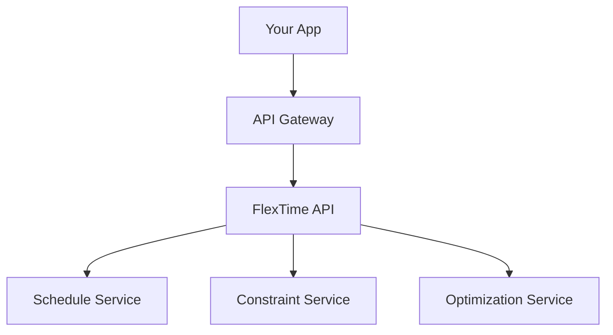
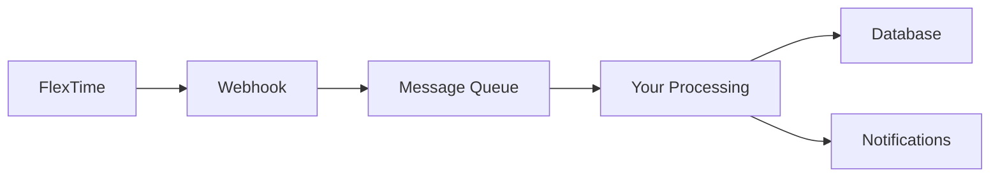

# FlexTime Developer Documentation

Welcome to the FlexTime Developer Documentation! This comprehensive guide covers everything you need to integrate with, extend, or contribute to the FlexTime Scheduling System.

## 🚀 Quick Start for Developers

### Prerequisites
- Node.js 18+ or Python 3.9+
- API access credentials
- Understanding of REST APIs and JSON

### 5-Minute Integration
```javascript
// Quick API test
const FlexTimeAPI = require('@big12/flextime-sdk');

const client = new FlexTimeAPI({
  apiKey: 'your-api-key',
  environment: 'production' // or 'sandbox'
});

// Get all schedules
const schedules = await client.schedules.list();
console.log(`Found ${schedules.length} schedules`);
```

## 📚 Documentation Sections

### API Reference
- **[REST API Documentation](./api/README.md)** - Complete API reference
- **[Authentication Guide](./api/authentication.md)** - API security and tokens
- **[Rate Limiting](./api/rate-limiting.md)** - Usage limits and best practices
- **[Error Handling](./api/error-handling.md)** - Error codes and recovery

### SDKs and Libraries
- **[JavaScript/Node.js SDK](./sdks/javascript.md)** - Official Node.js library
- **[Python SDK](./sdks/python.md)** - Official Python library
- **[C# SDK](./sdks/csharp.md)** - Official .NET library
- **[Go SDK](./sdks/go.md)** - Official Go library

### Integration Guides
- **[Webhook Integration](./webhooks/README.md)** - Real-time event notifications
- **[Calendar Integration](./integrations/calendar.md)** - Calendar system integration
- **[Database Integration](./integrations/database.md)** - Direct database access
- **[Mobile App Integration](./integrations/mobile.md)** - Mobile app development

### Advanced Topics
- **[Custom Constraints](./advanced/custom-constraints.md)** - Building custom constraint types
- **[Schedule Algorithms](./advanced/algorithms.md)** - Understanding optimization algorithms
- **[Performance Optimization](./advanced/performance.md)** - Optimizing API usage
- **[Security Best Practices](./advanced/security.md)** - Secure integration patterns

## 🔧 API Overview

### Base URL
```
Production:  https://api.flextime.big12.org/v1
Sandbox:     https://sandbox-api.flextime.big12.org/v1
```

### Authentication
```http
Authorization: Bearer your-jwt-token
Content-Type: application/json
X-API-Version: 2025-05-29
```

### Core Resources
| Resource | Description | Endpoints |
|----------|-------------|-----------|
| **Schedules** | Game schedules and tournaments | `/schedules` |
| **Teams** | Team information and management | `/teams` |
| **Venues** | Venue details and availability | `/venues` |
| **Constraints** | Scheduling rules and requirements | `/constraints` |
| **Games** | Individual game information | `/games` |
| **Seasons** | Season configuration and metadata | `/seasons` |

## 📖 Quick Reference

### Common Operations

#### Create a Schedule
```javascript
const schedule = await client.schedules.create({
  name: "2025 Basketball Regular Season",
  sport: "basketball",
  season: "2025-26",
  teams: ["kansas", "kansas-state", "baylor", "tcu"],
  constraints: {
    games_per_team: 18,
    home_away_balance: true,
    min_rest_days: 1
  }
});
```

#### Get Schedule Status
```javascript
const status = await client.schedules.getStatus(scheduleId);
console.log(`Status: ${status.state}, Progress: ${status.progress}%`);
```

#### Add Constraints
```javascript
await client.constraints.create({
  schedule_id: scheduleId,
  type: "venue_blackout",
  parameters: {
    venue_id: "kansas-allen-fieldhouse",
    blackout_dates: ["2025-12-25", "2025-01-01"]
  }
});
```

#### Export Schedule
```javascript
const exportData = await client.schedules.export(scheduleId, {
  format: "ics", // or "xlsx", "pdf", "json"
  include_metadata: true
});
```

## 🎯 SDK Comparison

| Feature | JavaScript | Python | C# | Go |
|---------|------------|--------|----|----|
| **Async/Await** | ✅ | ✅ | ✅ | ✅ |
| **Type Safety** | ✅ (TypeScript) | ✅ (Type Hints) | ✅ | ✅ |
| **Real-time Events** | ✅ WebSockets | ✅ WebSockets | ✅ SignalR | ✅ WebSockets |
| **Streaming** | ✅ | ✅ | ✅ | ✅ |
| **Caching** | ✅ | ✅ | ✅ | ✅ |

## 🔔 Webhook Events

FlexTime supports real-time notifications for:

```javascript
// Webhook event types
const eventTypes = [
  'schedule.created',
  'schedule.updated', 
  'schedule.optimized',
  'game.created',
  'game.updated',
  'constraint.violated',
  'export.completed'
];

// Example webhook payload
{
  "event": "schedule.optimized",
  "timestamp": "2025-05-29T10:30:00Z",
  "data": {
    "schedule_id": "sched_123",
    "optimization_score": 0.95,
    "improvements": {
      "travel_reduction": "15%",
      "conflict_resolution": 3
    }
  }
}
```

## 🏗️ Architecture Integration Patterns

### Microservices Pattern


### Event-Driven Pattern


## 🛠️ Development Tools

### Interactive API Explorer
```
https://docs.flextime.big12.org/api-explorer
```
- Live API testing
- Authentication setup
- Request/response examples
- Code generation

### Testing Utilities
```javascript
// Test data generator
const testData = FlexTime.generateTestData({
  teams: 8,
  games_per_team: 14,
  venues: 4,
  season_length: 120 // days
});

// Validation helpers
const isValid = FlexTime.validateSchedule(schedule);
const conflicts = FlexTime.findConflicts(schedule);
```

### Development Environment Setup
```bash
# Clone starter template
git clone https://github.com/big12/flextime-integration-starter
cd flextime-integration-starter

# Install dependencies
npm install

# Configure environment
cp .env.example .env
# Edit .env with your API credentials

# Start development server
npm run dev
```

## 📊 Performance Guidelines

### API Rate Limits
| Endpoint Type | Limit | Window |
|---------------|-------|--------|
| **Read Operations** | 1000/hour | Rolling |
| **Write Operations** | 100/hour | Rolling |
| **Schedule Generation** | 10/hour | Rolling |
| **Bulk Operations** | 5/hour | Rolling |

### Best Practices
1. **Use Caching**: Cache frequently accessed data
2. **Batch Requests**: Combine multiple operations
3. **Async Processing**: Use webhooks for long operations
4. **Pagination**: Handle large result sets properly

```javascript
// Efficient pagination
const allSchedules = [];
let cursor = null;

do {
  const response = await client.schedules.list({
    limit: 100,
    cursor: cursor
  });
  allSchedules.push(...response.data);
  cursor = response.pagination.next_cursor;
} while (cursor);
```

## 🔒 Security Considerations

### API Key Management
```javascript
// ❌ Don't do this
const apiKey = "sk_live_123..."; // Hardcoded

// ✅ Do this instead
const apiKey = process.env.FLEXTIME_API_KEY;
```

### Request Signing
```javascript
// For sensitive operations
const signature = FlexTime.signRequest(payload, secretKey);
await client.schedules.create(payload, { signature });
```

### CORS Configuration
```javascript
// For web applications
const client = new FlexTimeAPI({
  apiKey: process.env.FLEXTIME_API_KEY,
  cors: {
    origin: 'https://yourapp.com',
    credentials: true
  }
});
```

## 🧪 Testing and Validation

### Unit Testing
```javascript
// Jest example
import { FlexTimeAPI } from '@big12/flextime-sdk';

describe('FlexTime Integration', () => {
  let client;

  beforeEach(() => {
    client = new FlexTimeAPI({
      apiKey: 'test-key',
      environment: 'sandbox'
    });
  });

  test('should create schedule', async () => {
    const schedule = await client.schedules.create(testData);
    expect(schedule.id).toBeDefined();
    expect(schedule.status).toBe('pending');
  });
});
```

### Integration Testing
```javascript
// Sandbox environment testing
const testSuite = new FlexTime.TestSuite({
  environment: 'sandbox',
  cleanup: true // Auto-cleanup test data
});

await testSuite.run([
  'schedule_creation',
  'constraint_validation',
  'optimization_flow',
  'export_functionality'
]);
```

## 📱 Mobile Development

### React Native
```javascript
import FlexTime from '@big12/flextime-react-native';

const ScheduleView = () => {
  const [schedules, setSchedules] = useState([]);

  useEffect(() => {
    FlexTime.schedules.list().then(setSchedules);
  }, []);

  return (
    <FlexTimeScheduleList 
      schedules={schedules}
      onScheduleSelect={handleScheduleSelect}
    />
  );
};
```

### Flutter
```dart
import 'package:flextime_dart/flextime_dart.dart';

class ScheduleService {
  final FlexTimeClient _client = FlexTimeClient(
    apiKey: Environment.apiKey,
    environment: Environment.current,
  );

  Future<List<Schedule>> getSchedules() async {
    return await _client.schedules.list();
  }
}
```

## 🎓 Learning Resources

### Code Examples
- **[Example Integrations](./examples/README.md)** - Real-world integration examples
- **[Sample Applications](https://github.com/big12/flextime-examples)** - Complete sample apps
- **[Cookbook](./cookbook/README.md)** - Common integration recipes

### Community
- **[Developer Forum](https://community.flextime.big12.org)** - Developer discussions
- **[Stack Overflow](https://stackoverflow.com/questions/tagged/flextime)** - Q&A
- **[GitHub Issues](https://github.com/big12/flextime-sdk/issues)** - Bug reports and features

### Support
- **📧 Developer Support**: dev-support@flextime.big12.org
- **💬 Live Chat**: Available during business hours
- **📞 Technical Escalation**: For production issues

## 🚀 Getting Started Checklist

- [ ] Sign up for API access
- [ ] Read the [Authentication Guide](./api/authentication.md)
- [ ] Install your preferred SDK
- [ ] Complete the [Quick Start Tutorial](./quick-start.md)
- [ ] Set up webhook endpoints
- [ ] Test in sandbox environment
- [ ] Review [security best practices](./advanced/security.md)
- [ ] Deploy to production

---

*The FlexTime API is continuously evolving. Check our changelog for the latest updates and features.*

*Last updated: May 29, 2025*
*Current API Version: v1 (2025-05-29)*