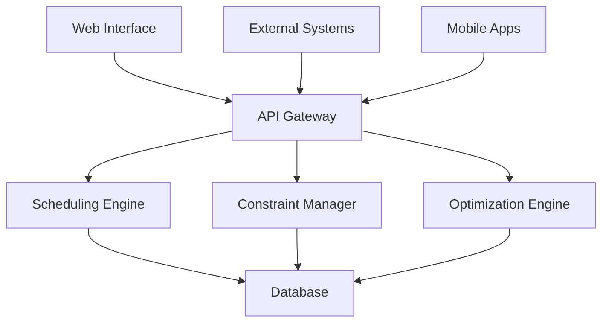

# FlexTime System Overview

FlexTime is an intelligent sports scheduling platform designed specifically for collegiate athletics. Built with AI-powered optimization and real-world constraints in mind, it helps athletic departments create efficient, fair, and cost-effective schedules.

## 🎯 What FlexTime Does

FlexTime automates the complex process of sports scheduling by:

- **Generating Optimal Schedules**: AI algorithms create schedules that minimize travel, respect constraints, and maximize fairness
- **Managing Complex Constraints**: Handle academic calendars, venue availability, travel restrictions, and sport-specific rules
- **Optimizing Resources**: Reduce travel costs, minimize conflicts, and balance competitive equity
- **Providing Real-Time Analytics**: Track schedule performance, costs, and optimization opportunities

## 🏗️ System Architecture



### Core Components

1. **Scheduling Engine**: The heart of FlexTime that generates schedules
2. **Constraint Manager**: Handles all rules and requirements
3. **Optimization Engine**: Improves schedules for cost and efficiency
4. **Analytics Dashboard**: Provides insights and performance metrics
5. **Integration Layer**: Connects with external systems (Notion, calendars, etc.)

## 🚀 Key Features

### Intelligent Scheduling
- **AI-Powered Generation**: Machine learning algorithms create optimal schedules
- **Multi-Sport Coordination**: Handle multiple sports simultaneously
- **Real-Time Optimization**: Continuous improvement suggestions
- **Scenario Planning**: Compare different scheduling approaches

### Advanced Constraint Management
- **Academic Integration**: Automatic academic calendar consideration
- **Venue Management**: Track availability and capacity
- **Travel Optimization**: Minimize distance and cost
- **Conference Rules**: Built-in conference-specific requirements

### Collaboration Tools
- **Real-Time Sharing**: Share schedules instantly with stakeholders
- **Comment System**: Collaborative feedback and approval process
- **Version Control**: Track changes and maintain schedule history
- **Notification System**: Automated alerts for changes and deadlines

### Integration Capabilities
- **Calendar Sync**: Export to Google Calendar, Outlook, Apple Calendar
- **Notion Integration**: Sync with Notion databases
- **API Access**: Full REST API for custom integrations
- **Data Export**: Multiple formats (Excel, PDF, CSV, JSON)

## 🎮 User Roles and Permissions

### Conference Administrator
- **Full System Access**: All features and settings
- **Multi-Sport Overview**: Dashboard across all sports
- **Advanced Analytics**: Conference-wide performance metrics
- **System Configuration**: Global settings and integrations

### Sport Administrator
- **Sport-Specific Access**: Full control within their sport
- **Schedule Management**: Create, modify, and optimize schedules
- **Team Coordination**: Manage teams and venues
- **Constraint Configuration**: Set sport-specific rules

### Team Representative
- **Limited Access**: View schedules and submit requests
- **Availability Updates**: Report venue and team availability
- **Comment/Feedback**: Provide input on schedule proposals
- **Data Export**: Download schedules in various formats

### Read-Only User
- **View Access**: See finalized schedules
- **Basic Export**: Download public schedule information
- **Notification Subscription**: Receive schedule updates

## 📊 Supported Sports

FlexTime currently supports the following Big 12 Conference sports:

### Fall Sports
- ⚽ **Soccer** (Men's & Women's)
- 🏈 **Football**
- 🏐 **Volleyball**
- 🏃 **Cross Country** (Men's & Women's)

### Winter Sports
- 🏀 **Basketball** (Men's & Women's)
- 🤸 **Gymnastics**
- 🏊 **Swimming & Diving** (Men's & Women's)
- 🏃 **Indoor Track & Field** (Men's & Women's)
- 🤼 **Wrestling**

### Spring Sports
- ⚾ **Baseball**
- 🥎 **Softball**
- 🎾 **Tennis** (Men's & Women's)
- 🏌️ **Golf** (Men's & Women's)
- 🏃 **Outdoor Track & Field** (Men's & Women's)
- 🚣 **Rowing**

## 🔧 Core Capabilities

### Schedule Generation
```javascript
// Example schedule generation parameters
{
  "sport": "basketball",
  "season": "2025-26",
  "teams": 16,
  "games_per_team": 18,
  "home_away_balance": true,
  "championship_format": "tournament"
}
```

### Constraint Types
- **Temporal**: Date ranges, blackout periods, minimum rest
- **Spatial**: Venue capacity, geographic restrictions
- **Competitive**: Fair play requirements, strength of schedule
- **Operational**: Broadcast windows, officiating availability

### Optimization Goals
1. **Minimize Travel Costs**: Reduce overall conference travel expenses
2. **Maximize Competitive Balance**: Ensure fair scheduling across teams
3. **Optimize Resource Usage**: Efficient venue and date utilization
4. **Reduce Conflicts**: Minimize overlaps with other sports

## 📈 Performance Metrics

FlexTime tracks several key performance indicators:

### Efficiency Metrics
- **Travel Distance Reduction**: Average reduction vs. manual scheduling
- **Cost Savings**: Estimated savings in travel and operations
- **Schedule Generation Time**: How quickly schedules are created
- **Constraint Satisfaction**: Percentage of requirements met

### Quality Metrics
- **Competitive Balance**: Strength of schedule variance
- **Fan Experience**: Geographic distribution of games
- **Student-Athlete Welfare**: Academic and travel considerations
- **Venue Utilization**: Efficiency of facility usage

## 🔄 Workflow Overview


1. **Setup**: Configure teams, venues, and basic parameters
2. **Configure**: Set constraints and requirements
3. **Generate**: Create initial schedule using AI algorithms
4. **Review**: Stakeholder review and feedback
5. **Optimize**: Refine schedule based on feedback
6. **Approve**: Final approval from authorized personnel
7. **Publish**: Distribute schedule to all stakeholders
8. **Monitor**: Track performance and make adjustments

## 🌐 Integration Ecosystem

FlexTime integrates with numerous external systems:

### Data Sources
- **Conference Databases**: Official team and venue information
- **Academic Calendars**: University academic schedules
- **Facility Management**: Venue availability systems
- **Travel Systems**: Cost and distance calculations

### Output Destinations
- **Team Management Systems**: Athletic department software
- **Public Websites**: Conference and university sites
- **Broadcasting**: TV and streaming schedule coordination
- **Mobile Apps**: Fan-facing schedule applications

## 💡 Getting Started

Ready to begin using FlexTime? Follow these steps:

1. **[Complete the Quick Start Guide](./quick-start.md)** (5 minutes)
2. **[Set Up Your Teams](./team-management.md)** (10 minutes)
3. **[Configure Basic Constraints](./constraint-management.md)** (15 minutes)
4. **[Generate Your First Schedule](./schedule-creation.md)** (5 minutes)

## 📞 Support and Resources

- **Documentation**: Comprehensive guides for all features
- **Video Tutorials**: Step-by-step visual guides
- **API Reference**: Complete technical documentation
- **Community Forum**: User discussions and tips
- **Direct Support**: Email and chat support during business hours

---

*FlexTime is continuously evolving with new features and improvements based on user feedback and technological advances.*

*Last updated: May 29, 2025*